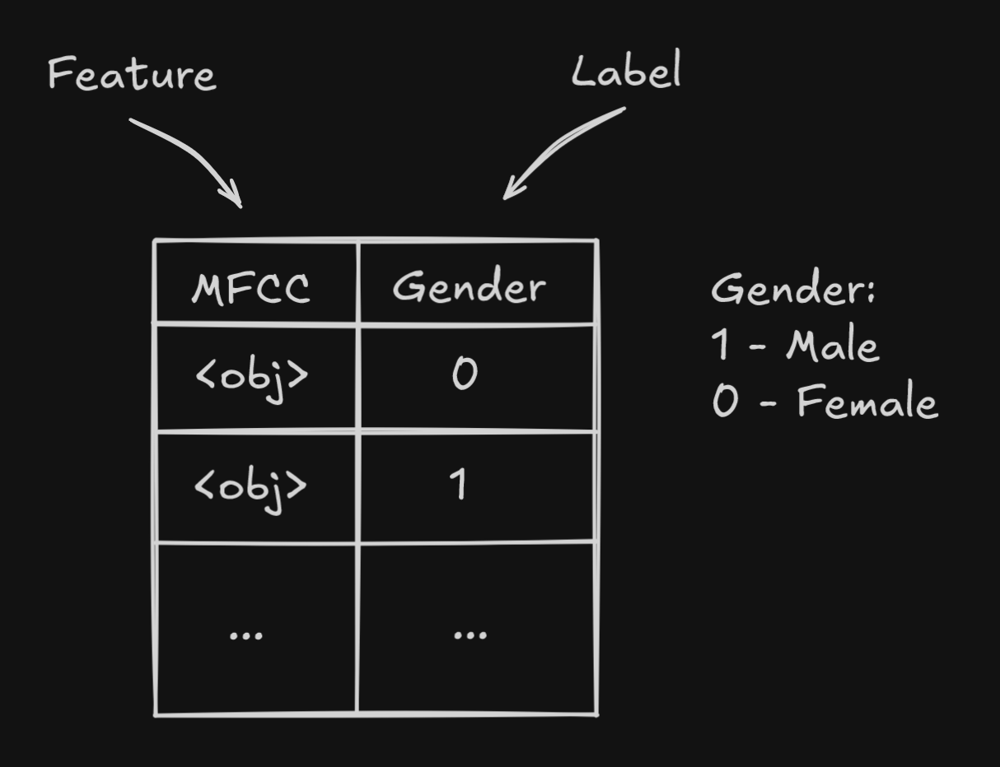

# Определение пола по голосу

## Описание проекта

Данный проект предназначен для определения пола говорящего на основе анализа его голоса. Используются аудио данные из набора данных [LibriSpeech](https://www.openslr.org/12), из которых извлекаются признаки MFCC (Mel-frequency cepstral coefficients). На основе этих признаков обучается нейронная сеть для классификации пола.

## Пример



в обучающем наборе 28539 файлов
- Мужчины: 14197 (49.75%)
- Женщины: 14342 (50.25%)

## Функциональность

Проект состоит из двух основных частей:

1. **Основной скрипт**: позволяет подготовить данные, извлечь признаки, обучить модель, протестировать её и сделать предсказание на основе пользовательского аудио файла.

2. **Gradio интерфейс**: предоставляет веб-интерфейс для загрузки аудио файла и получения предсказания пола.

## Структура проекта

- `neiro.py`: основной скрипт с функциональностью подготовки и обучения модели.
- `web_morda.py`: Gradio интерфейс для пользовательского взаимодействия.
- `src/`: директория для хранения подготовленных данных, модели и скейлера.
- `datasets/`: директория с аудио данными (`train-clean-100` и `dev-clean`).
- `SPEAKERS.TXT`: файл с метаданными о спикерах.

## Требования

- Python 3.x
- Установленные библиотеки:
  - `numpy`
  - `pandas`
  - `librosa`
  - `tensorflow`
  - `scikit-learn`
  - `joblib`
  - `tqdm`
  - `gradio`

## Установка зависимостей

```bash
pip install numpy pandas librosa tensorflow scikit-learn joblib tqdm gradio
```

## TODO

- **Варнинги**  
  - Устранить конфликты oneDNN, cuFFT, cuBLAS, cuDNN (оптимизация CUDA).  
  - Подавить варнинги AVX2 через настройку логов TensorFlow.  

- **Оптимизация MFCC**  
  - Реализовать многопоточность с `concurrent.futures`.  

- **Улучшение нейросети**  
  - Настроить гиперпараметры (learning rate, batch size).  
  - Учесть несбалансированность данных (взвешивание классов).  
  - Добавить больше слоев и нейронов.  

- **Обрезка записей**  
  - Удалять тишину с помощью `librosa.effects.trim`.  
  - Сохранять обновленные аудиофайлы с нужной длиной.  

- **Создать .env**
  - Указывать там путь до датасетов

- **Делать графики во время обучения нейросети**
  - Упростить отладку архитектуры через визуализацию важных параметров на графиках